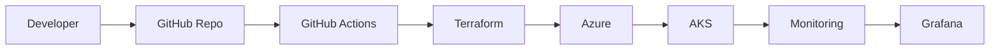

<h1 align="center">Hi 👋, I'm Akram Raza</h1>
<h3 align="center">A passionate Senior DevOps & Platform Engineer from India </h3>

- 🌱 I’m currently exploring **AI-powered DevSecOps & Copilot Studio workflows**

- 💬 Ask me about **Azure Landing Zone, IaC tool Terraform, GitHub Actions, Kubernetes, Docker**

- 📫 How to reach me **akkiraza.ar@gmail.com**

- ⚡ Fun fact: **I love automating complex infrastructure and optimizing platform engineering workflows!**

<h3 align="left">Connect with me:</h3>
<p align="left">
<a href="https://linkedin.com/in/akram raza"(https://www.linkedin.com/in/akram-raza-0137913a5/)" target="blank"></a>
</p>

<h3 align="left">Languages and Tools:</h3>
<p align="left"> </a> <a href="https://azure.microsoft.com/en-in/" target="_blank" rel="noreferrer">  </a> <a href="https://www.docker.com/" target="_blank" rel="noreferrer">  </a> <a href="https://cloud.google.com" target="_blank" rel="noreferrer">  </a> <a href="https://git-scm.com/" target="_blank" rel="noreferrer">  </a> <a href="https://grafana.com" target="_blank" rel="noreferrer">  </a> <a href="https://kubernetes.io" target="_blank" rel="noreferrer">  </a> <a href="https://www.linux.org/" target="_blank" rel="noreferrer">  </a> <a href="https://www.mongodb.com/" target="_blank" rel="noreferrer">  </a> <a href="https://www.mysql.com/" target="_blank" rel="noreferrer">  </a> <a href="https://www.nginx.com" target="_blank" rel="noreferrer">  </a> <a href="https://www.postgresql.org" target="_blank" rel="noreferrer">  </a> <a href="https://www.python.org" target="_blank" rel="noreferrer">  </a> <a href="https://www.tensorflow.org" target="_blank" rel="noreferrer">  </a> </p>

<p></p>

### 🌐 Connect with Me
 
<p align="left">
<a href="https://com/in/akram-raza-0137913a5

</n="center">

 
---
 
## 📊 GitHub Stats
 
<p align="center">

 
---
 
## 🔥 GitHub Streak
 
<p align="center">

 
---
 
## 📈 Contribution Graph
 
<img src="https://github-readme-raph.vercel.app/graph?username=i-akramR&theme=tokyo-night&hide_border=true
 
---
 
## ☁️ Azure Journey
 
```text
Azure
│
├── Landing Zone
├── Hub & Spoke
├── Identity & RBAC
├── Azure Policies
├── Terraform
├── GitHub Actions
└── AKS
```
 
---
 
## ⚙️ DevOps Pipeline
 

```mermaid
flowchart LR
 
A[Developer] --> B[GitHub Repo]
 
B --> C[GitHub Actions]
 
C --> D[Terraform]
 
D --> E[Azure]
 
E --> F[AKS]
 
F --> G[Monitoring]
 
G --> H[Grafana]
```
 
---
 
## 👀 Visitors
 
<p align="center">

 
<h3 align="center">✨ Automate Everything | Scale Anything ✨</h3>
